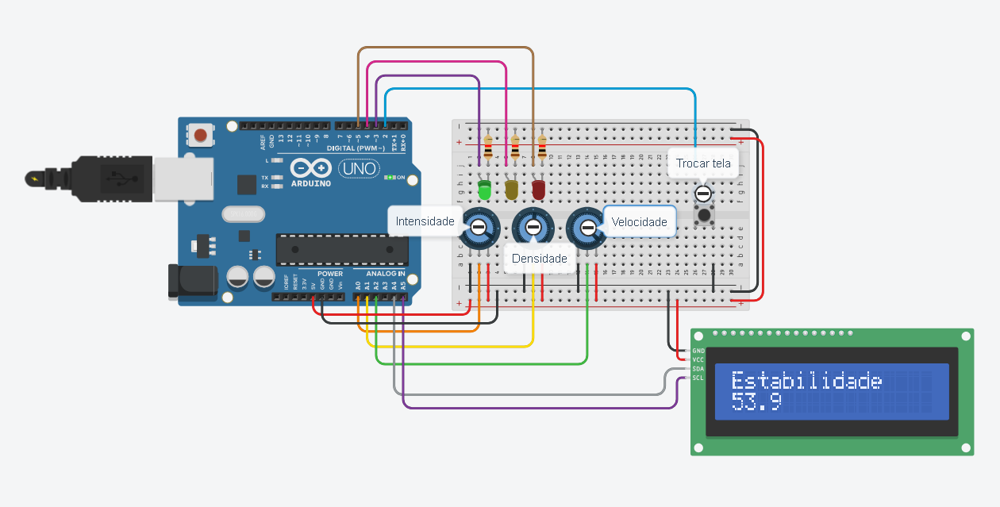

# 🚀 NebulaNoise - Monitoramento de Interferência Orbital

Projeto desenvolvido para a disciplina de **Edge Computing & Computer Systems**, simulando uma estação de monitoramento de comunicações orbitais capaz de identificar níveis de interferência em sinais de satélite.

O sistema utiliza Arduino para processar localmente os dados recebidos, classificando o nível de estabilidade da comunicação e alertando o operador através de LEDs e display LCD.

---

## 📌 Objetivo

Simular uma estação de monitoramento do projeto **NebulaNoise**, responsável por detectar interferências em comunicações orbitais e alertar operadores sobre possíveis riscos de instabilidade em serviços dependentes de satélites.

---

## 🌎 Problema Abordado

Com o crescimento da quantidade de satélites e detritos espaciais em órbita, sistemas de comunicação podem sofrer interferências que afetam:

- GPS
- Internet via satélite
- Monitoramento remoto
- Sistemas de telecomunicações

O NebulaNoise propõe um monitoramento preventivo dessas condições, permitindo identificar situações críticas antes que ocorram falhas nos serviços.

---

## ⚙️ Funcionamento

O circuito utiliza três potenciômetros para simular variáveis que influenciam a estabilidade da comunicação orbital:

- Intensidade do sinal
- Densidade de interferências
- Velocidade de propagação das perturbações

Os valores são convertidos para porcentagens e utilizados para calcular um índice de estabilidade.

A partir desse índice, o sistema determina o nível de alerta e sinaliza o operador.

---

## 🚦 Estados do Sistema

| Estado | Indicador |
|----------|----------|
| Comunicação Estável | 🟢 LED Verde |
| Atenção | 🟡 LED Amarelo |
| Risco Crítico | 🔴 LED Vermelho |

---

## 🖥️ Interface LCD

O display LCD apresenta informações do sistema em diferentes telas.

As telas disponíveis são:

1. Estabilidade
2. Intensidade
3. Densidade
4. Velocidade

A navegação é realizada através de um botão conectado ao Arduino.

---

## 🧠 Cálculo de Estabilidade

O índice de estabilidade é calculado pela seguinte fórmula:

```text
Estabilidade = Intensidade /
(1 + 0,7 × Densidade + 0,4 × Velocidade)
```

Quanto maiores os níveis de interferência, menor será o valor da estabilidade.

---

## 🛠️ Componentes Utilizados

- Arduino Uno
- Display LCD 16x2 I2C
- Botão Push Button
- 3 Potenciômetros
- LED Verde
- LED Amarelo
- LED Vermelho
- Resistores
- Protoboard
- Jumpers

---

## 🔌 Ligações

| Componente | Pino |
|------------|------|
| LED Verde | 3 |
| LED Amarelo | 4 |
| LED Vermelho | 5 |
| Botão | 2 |
| Intensidade | A0 |
| Densidade | A1 |
| Velocidade | A2 |

---

## 🖼️ Circuito



O circuito utiliza potenciômetros para simular diferentes condições de comunicação orbital e LEDs para indicar o nível de estabilidade calculado.

---

## 🧪 Código

O código-fonte completo está disponível em:

```
codigo.ino
```

---

## 🚀 Como Executar

1. Monte o circuito conforme o esquema.
2. Instale as bibliotecas:
   - LiquidCrystal_I2C
   - Wire
3. Faça o upload do código para o Arduino.
4. Ajuste os potenciômetros para alterar as condições da simulação.
5. Utilize o botão para navegar entre as telas do display.

---

## 🔗 Simulação

A simulação completa pode ser acessada em:

[🔗 Link do Tinkercad](https://www.tinkercad.com/things/as4YV05HzV2-super-esboo-juttuli?sharecode=4NVMrlYDDceuWc8699c5if8OAysu0qqHHOq08qRbhU0)

---

## ☁️ Relação com Edge Computing

O projeto aplica conceitos de Edge Computing ao realizar todo o processamento localmente no Arduino.

As informações são analisadas diretamente no dispositivo, permitindo identificar eventos críticos e emitir alertas sem depender de processamento remoto, simulando aplicações reais utilizadas em sistemas espaciais e de telecomunicações.

---

## 👥 Integrantes

- André Victor
- Davi Dias
- David Mikael
- Gabriel Novaga
- Matheus Monteiro
